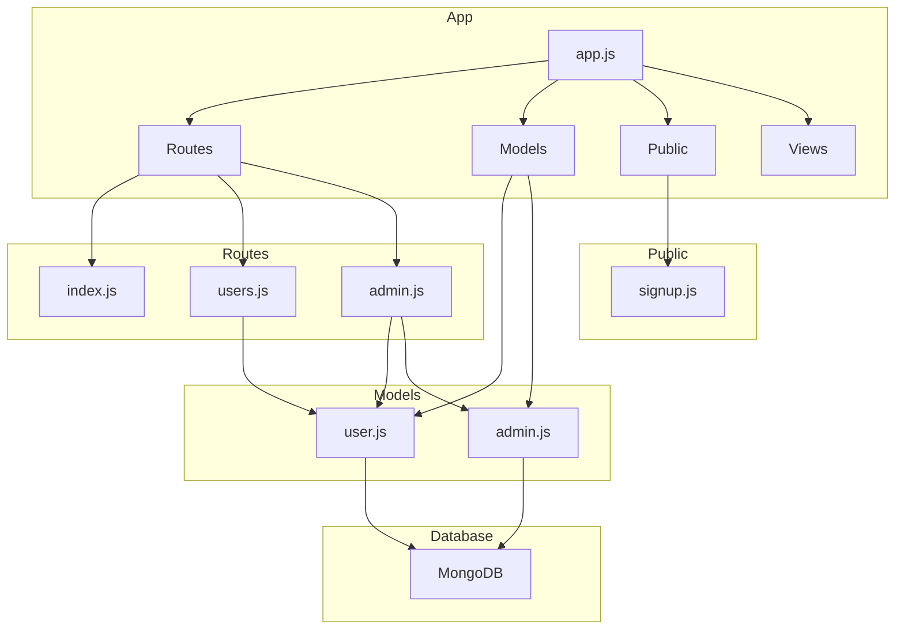

    

    <b>Automatic Architecture Diagrams from Code</b> 
    <a href="https://github.com/JashanMaan28/swark-continued">GitHub (Fork)</a> • <a href="https://github.com/swark-io/swark">Original Project</a>

## Usage Instructions

1. **Render the Diagram**: Use the links below to open it in Mermaid Live Editor, or install the [Mermaid Support](https://marketplace.visualstudio.com/items?itemName=bierner.markdown-mermaid) extension.
2. **Recommended Model**: If available for you, use `gemini` [language model](vscode://settings/swark-continued.languageModel). It can process more files and generates better diagrams.
3. **Iterate for Best Results**: Language models are non-deterministic. Generate the diagram multiple times and choose the best result.

## Generated Content
**Model**: GPT-4o - [Change Model](vscode://settings/swark-continued.languageModel)  
**Mermaid Live Editor**: [View](https://mermaid.live/view#pako:eNp1UsFugzAM_RWUczspcOMwqZD1Nmnapl2SHgJxIRWEiCTapqr_vpSsAkrJzc9-9nt2zqjsBKAUMVX1XNfRJ2Eq8s-4IgA7rQNyfTvKtX46mUO03T5HGX3vnAVzmBQMiZy--q7NMkHomysaWS4SL_RLwveNAEowdacjjBp5GaZSCfi5qpmgMXUGenOHJpSLVqo7NJjACyReIMm6ruB0ZOR4UDAflcePBORhWXiBxOvjwv5GBsHUyEo5PW9NwrrxeiPCLS-4gZGz91dTVUey5RVyPPTb_0fxNMrimY0seRh6S2iDWuhbLoX_b2eGbA0tMJRGDAk4ctdYhi6-yGnBLRDJvdAWpbZ3sEHc2e7jV5W3uO9cVaP0yBsDlz8yp8KX) | [Edit](https://mermaid.live/edit#pako:eNp1UsFugzAM_RWUczspcOMwqZD1Nmnapl2SHgJxIRWEiCTapqr_vpSsAkrJzc9-9nt2zqjsBKAUMVX1XNfRJ2Eq8s-4IgA7rQNyfTvKtX46mUO03T5HGX3vnAVzmBQMiZy--q7NMkHomysaWS4SL_RLwveNAEowdacjjBp5GaZSCfi5qpmgMXUGenOHJpSLVqo7NJjACyReIMm6ruB0ZOR4UDAflcePBORhWXiBxOvjwv5GBsHUyEo5PW9NwrrxeiPCLS-4gZGz91dTVUey5RVyPPTb_0fxNMrimY0seRh6S2iDWuhbLoX_b2eGbA0tMJRGDAk4ctdYhi6-yGnBLRDJvdAWpbZ3sEHc2e7jV5W3uO9cVaP0yBsDlz8yp8KX)

